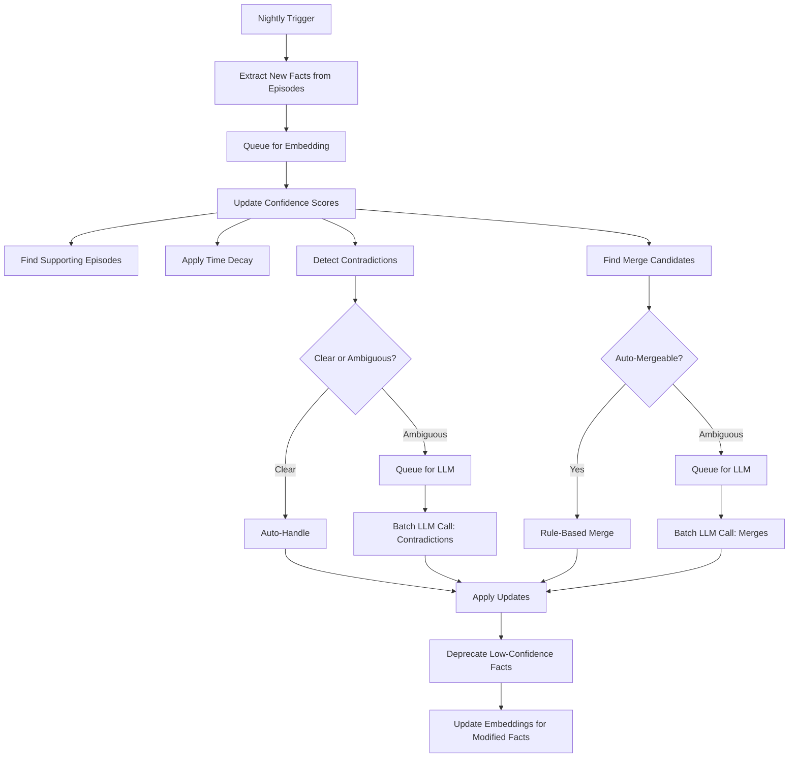

# Semantic Fact System: Architectural Plan

## Current State Assessment

- **EXTRACTION:** ✅ Working satisfactorily via HDBSCAN clustering
- **EMBEDDING:** ✅ Implemented
- **RECALL:** ❌ Not implemented
- **MANAGING:** ❌ No confidence update system
- **MERGING:** ❌ Many duplicate/related facts accumulating

---

## Core Philosophy: Batch Processing + Lazy Evaluation

**Principle:** Heavy operations run in nightly consolidation. Retrieval is cheap. LLM calls are batched and reserved for ambiguous cases only.

---

## System Architecture

### 2. RECALL: Hybrid Retrieval with Diversity

**Query Flow:**
```
User Query → Generate Query Embedding 
           → Vector Search (Top 20 facts)
           → Symbolic Filters (confidence > 0.5, status='active')
           → Diversity Sampling (Top 5 from different clusters)
           → Inject into Context
```

**Diversity Sampling Algorithm:**
1. Cluster the 20 candidates by embedding similarity (threshold ~0.8)
2. Take highest-confidence fact from each cluster
3. Continue until context budget filled or 5 facts selected

**Benefits:**
- Prevents redundant information ("User likes coffee" × 5 variants)
- Maximizes information density in context window
- Simple clustering—no additional libraries needed

**Symbolic Filters:**
- `confidence > 0.5` (exclude low-quality facts)
- `status = 'active'` (exclude deprecated)
- `category` matching when relevant

**API Cost:** Zero (pure retrieval, no generation)

---

### 3. MANAGING CONFIDENCE: Evidence-Based Updates

**Runs During:** Nightly consolidation via `run_consolidation.py`

**Rule-Based Confidence Updates (No LLM):**

```python
# Pseudocode
confidence_new = confidence_old * factors

factors = [
    evidence_accumulation(),  # New supporting episodes found
    time_decay(),             # Reduce if no recent reinforcement
    contradiction_penalty(),  # Lower if conflicted (clear cases only)
    user_confirmation()       # Explicit user validation (if any)
]
```

**Evidence Accumulation:**
- Find episodes with high embedding similarity to fact
- For each new supporting episode: `confidence += 0.05 * (1 - confidence)`
- Asymptotic growth prevents over-confidence

**Time Decay:**
```
days_since_last_evidence = (now - last_updated).days
confidence *= exp(-days * DECAY_RATE)
```

**Contradiction Handling:**
- **Clear contradictions** (high similarity + opposite meaning): Reduce both facts' confidence, flag for LLM resolution
- **Ambiguous conflicts**: Queue for batched LLM judgment

**Confidence Thresholds:**
- `< 0.3`: Auto-deprecate (`status='deprecated'`, excluded from retrieval)
- `0.3 - 0.5`: Active but low-priority
- `> 0.5`: Full participation in retrieval

**LLM Batch Call:** Resolve flagged contradictions in single API call per consolidation

---

### 4. MERGING: Deduplication with Evidence Preservation

**Runs During:** Nightly consolidation via `run_consolidation.py`

**Three-Stage Process:**

#### Stage 1: Find Candidates (Free)
```
For all active facts:
    Find pairs with cosine_similarity(embedding) > 0.85
    Group into merge candidate clusters
```

#### Stage 2: Rule-Based Auto-Merge (No LLM)
```python
for cluster in candidates:
    if all_same_category(cluster) and no_contradiction_detected(cluster):
        # Keep highest confidence fact
        winner = max(cluster, key=lambda f: f.confidence)
        
        # Merge evidence lineage
        winner.derived_from = union([f.derived_from for f in cluster])
        winner.evidence_count = sum([f.evidence_count for f in cluster])
        
        # Archive others
        for loser in cluster - {winner}:
            loser.status = 'merged_into'
            loser.merged_into_id = winner.id
```

**Auto-Merge Criteria:**
- Same category
- Embedding similarity > 0.85
- No detected contradiction (similar confidence, no opposite valence)

#### Stage 3: LLM Validation (Ambiguous Cases Only)
```python
ambiguous_clusters = [
    c for c in candidates 
    if has_contradiction(c) or different_categories(c)
]

# Single batched LLM call
merge_decisions = llm_batch_decide(ambiguous_clusters)
apply_merge_decisions(merge_decisions)
```

**LLM Prompt Structure:**
```
Given these semantically similar facts:
1. "User is a backend developer" (conf: 0.9)
2. "User works in frontend" (conf: 0.7)

Are these: [MERGE / KEEP_BOTH / CONTRADICTION]?
If MERGE, which should be the canonical version?
```

**API Cost:** 1-2 batched calls per consolidation cycle

---

### 5. INTEGRATION: Fact Lifecycle

#### At Consolidation (Nightly via `run_consolidation.py`):



#### At Retrieval (Every Response):


---

## Cost Analysis

**Assumptions:**
- 500 facts at steady state
- 50 new episodes/week → ~5-10 new facts/week
- Weekly consolidation

**Per Consolidation Cycle:**

| Operation | LLM Calls | Estimated Cost |
|-----------|-----------|----------------|
| Embed new facts (5-10) | 0 | ~$0.001 |
| Merge ambiguous clusters (2-3) | 1 batch | ~$0.02 |
| Resolve contradictions (1-2) | 1 batch | ~$0.02 |
| Evidence validation (10 facts) | 0 (rule-based) | $0 |
| **Total per week** | **~2 LLM calls** | **~$0.04** |

**Retrieval:** Zero cost (no generation)

---

## Key Design Decisions

### Merging Strategy
- **Highest confidence fact wins** as canonical version
- **Evidence lineage preserved:** Merge all `derived_from` arrays
- **Losers archived** with `merged_into_id` pointer for traceability

### Recall Strategy  
- **Diversity sampling** prevents redundant information
- **Top-5 fact limit** to preserve context budget
- **Confidence-weighted:** Higher confidence facts prioritized within clusters

### Confidence Management
- **Rule-based by default:** 90% of updates need no LLM
- **Asymptotic growth:** Prevents runaway confidence
- **Deprecation threshold:** Facts below 0.3 automatically excluded
- **No passive confirmation:** Low-confidence facts naturally decay or get reinforced

### Contradiction Handling
- **Clear contradictions:** Handled automatically (reduce both confidences)
- **Ambiguous conflicts:** Batched LLM resolution once per cycle
- **Context-dependent facts:** System can keep both if LLM determines they're valid in different contexts

---

## Implementation Priority

1. **EMBEDDING** (Week 1)
   - Add `status` field to semantic_memory table
   - Implement async embedding queue (mirror episodic pattern)
   - Background worker to process queue

2. **RECALL** (Week 1-2)
   - Vector search on fact embeddings
   - Symbolic filtering by confidence/status
   - Diversity sampling via simple clustering
   - Context injection logic

3. **MANAGING CONFIDENCE** (Week 2)
   - Rule-based evidence accumulation
   - Time decay calculation
   - Auto-deprecation for low confidence
   - Supporting episode finder (embedding similarity)

4. **MERGING** (Week 3)
   - Pairwise similarity detection
   - Rule-based auto-merge for clear cases
   - Merge candidate queue for ambiguous cases

5. **LLM VALIDATION** (Week 4)
   - Batched contradiction resolution
   - Batched merge decisions
   - Integration into `run_consolidation.py`

---

## Success Metrics

- **Deduplication rate:** % of duplicate facts successfully merged per cycle
- **Confidence accuracy:** Do high-confidence facts have more supporting episodes?
- **Retrieval relevance:** User feedback on fact accuracy in responses
- **Cost efficiency:** Stay under $0.10/week for consolidation operations
- **Deprecation rate:** % of facts that naturally decay vs. get reinforced