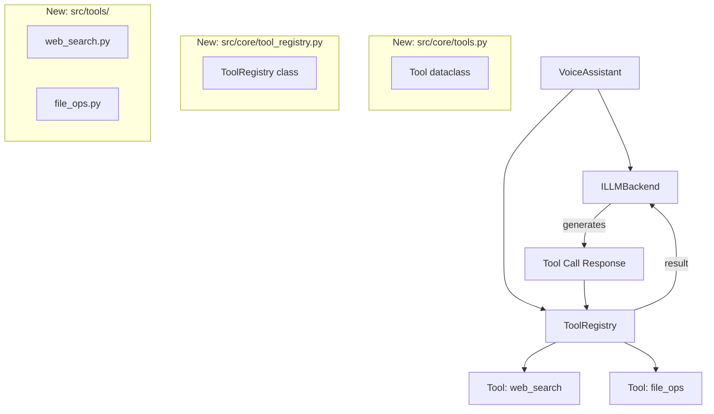

# Tool Calling Implementation Plan

## Overview
Add function/tool calling capabilities to Miyori, allowing the LLM to decide when to use external tools (web search, file operations, etc.) and process their results.

## Architecture Changes

### Design Philosophy: Simple Tools, No Interfaces

Unlike the core components (TTS, Speech Input, LLM), **tools do NOT use the interface/implementation pattern**. Here's why:

- **Core components** have multiple implementations you might swap (Google AI ↔ Anthropic, Porcupine ↔ Whisper). The interface defines a contract.
- **Tools** are unique, standalone functions. You don't swap "implementations of web search" — you just add/remove tools.
- **Less boilerplate**: Each tool is a simple function + metadata, not a class with abstract methods.
- **More Pythonic**: Functions with decorators/metadata feel more natural for a plugin system.

Tools are **functions that register themselves** with the `ToolRegistry`. The registry manages discovery and execution.

### New Components



## Implementation Steps

### Step 1: Define Simple Tool Structure

**File**: `src/core/tools.py`

```python
from typing import Any, Dict, List, Callable
from dataclasses import dataclass

@dataclass
class ToolParameter:
    """Describes a single parameter for a tool."""
    name: str
    type: str  # "string", "number", "boolean", "array", "object"
    description: str
    required: bool = True
    enum: List[str] | None = None  # For restricted values

@dataclass
class Tool:
    """A tool that the LLM can call."""
    name: str
    description: str
    parameters: List[ToolParameter]
    function: Callable[..., str]  # The actual function to execute
    
    def execute(self, **kwargs) -> str:
        """Execute the tool's function."""
        return self.function(**kwargs)
```

### Step 2: Create Tool Registry

**File**: `src/core/tool_registry.py`

```python
from typing import Dict, List, Optional
from src.core.tools import Tool

class ToolRegistry:
    """Central registry for all available tools."""
    
    def __init__(self):
        self._tools: Dict[str, Tool] = {}
    
    def register(self, tool: Tool) -> None:
        """Register a tool by its name."""
        self._tools[tool.name] = tool
        print(f"✓ Registered tool: {tool.name}")
    
    def get_tool(self, name: str) -> Optional[Tool]:
        """Get a tool by name."""
        return self._tools.get(name)
    
    def get_all(self) -> List[Tool]:
        """Get all registered tools."""
        return list(self._tools.values())
    
    def execute(self, tool_name: str, **parameters) -> str:
        """Execute a tool and return its result."""
        tool = self.get_tool(tool_name)
        if not tool:
            return f"Error: Tool '{tool_name}' not found"
        
        try:
            result = tool.execute(**parameters)
            return result
        except Exception as e:
            return f"Error executing {tool_name}: {str(e)}"
```

### Step 3: Extend LLM Backend Interface

**File**: `src/interfaces/llm.py` (modify existing)

```python
# Add to existing ILLMBackend interface:

@abstractmethod
def generate_stream_with_tools(
    self,
    prompt: str,
    tools: List[Tool],
    on_chunk: Callable[[str], None],
    on_tool_call: Callable[[str, Dict[str, Any]], str]
) -> None:
    """
    Generate streaming response with tool support.
    
    Args:
        prompt: User's input
        tools: Available tools
        on_chunk: Callback for text chunks
        on_tool_call: Callback when tool is needed. 
                      Takes (tool_name, parameters), returns result string.
    """
    pass
```

### Step 4: Implement First Tool - Web Search

**File**: `src/tools/web_search.py`

```python
import requests
from bs4 import BeautifulSoup
from src.core.tools import Tool, ToolParameter

def web_search(query: str, num_results: int = 3) -> str:
    """
    Search the web using DuckDuckGo.
    
    Args:
        query: Search query string
        num_results: Number of results to return (1-10)
    
    Returns:
        Formatted search results as a string
    """
    print(f"🔍 Searching web: {query}")
    
    try:
        # Use DuckDuckGo HTML search (no API key needed)
        url = f"https://html.duckduckgo.com/html/?q={requests.utils.quote(query)}"
        headers = {"User-Agent": "Mozilla/5.0"}
        
        response = requests.get(url, headers=headers, timeout=5)
        soup = BeautifulSoup(response.text, 'html.parser')
        
        # Parse results
        results = []
        for result in soup.select('.result')[:num_results]:
            title_elem = result.select_one('.result__title')
            snippet_elem = result.select_one('.result__snippet')
            url_elem = result.select_one('.result__url')
            
            if title_elem and snippet_elem:
                results.append({
                    'title': title_elem.get_text(strip=True),
                    'snippet': snippet_elem.get_text(strip=True),
                    'url': url_elem.get_text(strip=True) if url_elem else 'N/A'
                })
        
        if not results:
            return f"No results found for '{query}'"
        
        # Format output
        formatted = f"Search results for '{query}':\n"
        for i, result in enumerate(results, 1):
            formatted += f"\n{i}. {result['title']}\n"
            formatted += f"   {result['snippet']}\n"
            formatted += f"   {result['url']}\n"
        
        return formatted
        
    except Exception as e:
        return f"Search failed: {str(e)}"


# Create the tool definition
web_search_tool = Tool(
    name="web_search",
    description="Search the web for current information. Use this when you need up-to-date facts, news, or information not in your training data.",
    parameters=[
        ToolParameter(
            name="query",
            type="string",
            description="The search query",
            required=True
        ),
        ToolParameter(
            name="num_results",
            type="number",
            description="Number of results to return (1-10)",
            required=False
        )
    ],
    function=web_search
)
```

### Step 5: Implement Second Tool - File Operations

**File**: `src/tools/file_ops.py`

```python
import os
from pathlib import Path
from src.core.tools import Tool, ToolParameter

# Configuration - set allowed directories
ALLOWED_DIRECTORIES = [Path("./workspace").resolve(), Path("./documents").resolve()]

def _is_path_allowed(path: Path) -> bool:
    """Check if path is within allowed directories."""
    try:
        resolved = path.resolve()
        return any(resolved.is_relative_to(allowed) for allowed in ALLOWED_DIRECTORIES)
    except (ValueError, RuntimeError):
        return False

def _read_file(path: str) -> str:
    """Read and return file contents."""
    target_path = Path(path)
    
    if not _is_path_allowed(target_path):
        return f"Error: Access denied. Path must be in allowed directories: {[str(d) for d in ALLOWED_DIRECTORIES]}"
    
    try:
        if not target_path.exists():
            return f"Error: File not found: {path}"
        
        if not target_path.is_file():
            return f"Error: Not a file: {path}"
        
        with open(target_path, 'r', encoding='utf-8') as f:
            content = f.read()
        
        # Limit content length
        if len(content) > 5000:
            content = content[:5000] + "\n... (truncated to 5000 chars)"
        
        return f"Contents of {target_path.name}:\n\n{content}"
    except Exception as e:
        return f"Error reading file: {str(e)}"

def _write_file(path: str, content: str) -> str:
    """Write content to a file."""
    target_path = Path(path)
    
    if not _is_path_allowed(target_path):
        return f"Error: Access denied. Path must be in allowed directories: {[str(d) for d in ALLOWED_DIRECTORIES]}"
    
    try:
        # Ensure parent directory exists
        target_path.parent.mkdir(parents=True, exist_ok=True)
        
        # Write file
        with open(target_path, 'w', encoding='utf-8') as f:
            f.write(content)
        
        return f"✓ Successfully wrote {len(content)} characters to {target_path.name}"
    except Exception as e:
        return f"Error writing file: {str(e)}"

def _list_directory(path: str) -> str:
    """List directory contents."""
    target_path = Path(path)
    
    if not _is_path_allowed(target_path):
        return f"Error: Access denied. Path must be in allowed directories: {[str(d) for d in ALLOWED_DIRECTORIES]}"
    
    try:
        if not target_path.exists():
            return f"Error: Directory not found: {path}"
        
        if not target_path.is_dir():
            return f"Error: Not a directory: {path}"
        
        items = list(target_path.iterdir())
        
        result = f"Contents of {target_path}:\n"
        for item in sorted(items):
            prefix = "📁" if item.is_dir() else "📄"
            size = f" ({item.stat().st_size} bytes)" if item.is_file() else ""
            result += f"\n{prefix} {item.name}{size}"
        
        return result
    except Exception as e:
        return f"Error listing directory: {str(e)}"

def file_operations(operation: str, path: str, content: str = None) -> str:
    """
    Perform file operations (read, write, or list).
    
    Args:
        operation: Either "read", "write", or "list"
        path: Path to the file or directory
        content: Content to write (only used for write operation)
    
    Returns:
        File contents, write confirmation, or directory listing
    """
    print(f"📁 File operation: {operation} {path}")
    
    if operation == "read":
        return _read_file(path)
    elif operation == "write":
        if content is None:
            return "Error: 'content' parameter required for write operation"
        return _write_file(path, content)
    elif operation == "list":
        return _list_directory(path)
    else:
        return f"Error: Unknown operation '{operation}'. Use 'read', 'write', or 'list'."


# Create the tool definition
file_ops_tool = Tool(
    name="file_operations",
    description="Read files, write files, or list directory contents. Only works in allowed directories for safety.",
    parameters=[
        ToolParameter(
            name="operation",
            type="string",
            description="Operation to perform: 'read', 'write', or 'list'",
            required=True,
            enum=["read", "write", "list"]
        ),
        ToolParameter(
            name="path",
            type="string",
            description="File or directory path",
            required=True
        ),
        ToolParameter(
            name="content",
            type="string",
            description="Content to write to file (only for write operation)",
            required=False
        )
    ],
    function=file_operations
)
```

### Step 6: Update Assistant Loop

**File**: `src/core/assistant.py` (modify existing)

```python
from src.core.tool_registry import ToolRegistry

class VoiceAssistant:
    def __init__(
        self,
        speech_input: ISpeechInput,
        speech_output: ISpeechOutput,
        llm_backend: ILLMBackend,
        tool_registry: ToolRegistry,  # NEW
        config: Dict[str, Any]
    ):
        self.speech_input = speech_input
        self.speech_output = speech_output
        self.llm_backend = llm_backend
        self.tool_registry = tool_registry  # NEW
        self.config = config
        self.exit_phrases = config.get("assistant", {}).get("exit_phrases", ["exit", "quit", "goodbye"])
    
    def run(self) -> None:
        """Main assistant loop with tool support."""
        print("🎤 Assistant ready. Listening...")
        
        while True:
            # Get user input
            user_input = self.speech_input.listen()
            if not user_input:
                continue
            
            print(f"User: {user_input}")
            
            # Check for exit
            if any(phrase in user_input.lower() for phrase in self.exit_phrases):
                print("👋 Goodbye!")
                break
            
            # Process with tools
            self._handle_with_tools(user_input)
    
    def _handle_with_tools(self, user_input: str) -> None:
        """Handle user input with tool support."""
        
        def on_chunk(text: str) -> None:
            """Stream text to TTS."""
            self.speech_output.speak(text)
        
        def on_tool_call(tool_name: str, parameters: Dict[str, Any]) -> str:
            """Execute tool and return result."""
            print(f"🔧 AI requested tool: {tool_name}")
            print(f"   Parameters: {parameters}")
            
            result = self.tool_registry.execute(tool_name, **parameters)
            print(f"✓ Tool result: {result[:100]}...")
            
            return result
        
        # Get all registered tools
        tools = self.tool_registry.get_all()
        
        # Generate response with tool support
        self.llm_backend.generate_stream_with_tools(
            prompt=user_input,
            tools=tools,
            on_chunk=on_chunk,
            on_tool_call=on_tool_call
        )
```

### Step 7: Update Configuration

**File**: `config.json` (add section)

```json
{
  "tools": {
    "enabled": true,
    "web_search": {
      "enabled": true,
      "timeout_seconds": 5
    },
    "file_ops": {
      "enabled": true,
      "allowed_directories": ["./workspace", "./documents"]
    }
  }
}
```

### Dependencies

Add to `requirements.txt`:
```
requests>=2.31.0        # For web_search tool
beautifulsoup4>=4.12.0  # For parsing web search results
google-generativeai>=0.3.0  # Ensure latest version with function calling
```

### Step 8: Implement Tool Support in LLM Backend

**File**: `src/implementations/llm/google_ai/backend.py` (modify)

```python
from src.core.tools import Tool
import google.generativeai as genai

MAX_TOOL_CALLS_PER_TURN = 5  # Prevent infinite loops

def generate_stream_with_tools(
    self,
    prompt: str,
    tools: List[Tool],
    on_chunk: Callable[[str], None],
    on_tool_call: Callable[[str, Dict[str, Any]], str]
) -> None:
    """
    Generate with tool support using a proper state machine.
    
    State flow:
    USER_PROMPT → MODEL_GENERATION → [TEXT | TOOL_CALL] → EXECUTE_TOOL → CONTINUE_GENERATION
    """
    
    # Convert tools to Google AI format
    google_tools = self._convert_tools_to_gemini_format(tools)
    
    # Initialize conversation history
    conversation = [
        {"role": "user", "parts": [prompt]}
    ]
    
    tool_call_count = 0
    
    # Main generation loop with state tracking
    while tool_call_count < MAX_TOOL_CALLS_PER_TURN:
        # Generate response
        response = self.model.generate_content(
            conversation,
            tools=google_tools if google_tools else None,
            stream=False  # Use non-streaming for tool calls to get complete response
        )
        
        # Check if we got a complete response
        if not response.parts:
            break
        
        has_tool_call = False
        
        # Process all parts of the response
        for part in response.parts:
            # Handle tool calls
            if hasattr(part, 'function_call') and part.function_call:
                has_tool_call = True
                tool_call_count += 1
                
                if tool_call_count > MAX_TOOL_CALLS_PER_TURN:
                    print(f"⚠️  Max tool calls ({MAX_TOOL_CALLS_PER_TURN}) reached, stopping")
                    break
                
                function_call = part.function_call
                tool_name = function_call.name
                
                # Extract parameters safely
                parameters = {}
                if function_call.args:
                    parameters = dict(function_call.args)
                
                # Execute tool via callback
                result = on_tool_call(tool_name, parameters)
                
                # Append model's tool call to conversation
                conversation.append({
                    "role": "model",
                    "parts": [part]  # Keep the original function_call part
                })
                
                # Append tool result to conversation
                conversation.append({
                    "role": "function",
                    "parts": [{
                        "function_response": {
                            "name": tool_name,
                            "response": {"result": result}
                        }
                    }]
                })
                
            # Handle text output
            elif hasattr(part, 'text') and part.text:
                on_chunk(part.text)
        
        # If no tool calls were made, we're done
        if not has_tool_call:
            break
        
        # If we hit the limit, generate final response without tools
        if tool_call_count >= MAX_TOOL_CALLS_PER_TURN:
            final_response = self.model.generate_content(
                conversation + [{"role": "user", "parts": ["Please summarize your findings."]}],
                tools=None,  # No more tools
                stream=False
            )
            if final_response.text:
                on_chunk(final_response.text)
            break

def _convert_tools_to_gemini_format(self, tools: List[Tool]) -> List[genai.types.Tool]:
    """
    Convert Tool objects to Gemini's tool format.
    
    Gemini expects a list of Tool objects, each containing function declarations.
    See: https://ai.google.dev/api/python/google/generativeai/types/Tool
    """
    if not tools:
        return []
    
    # Build function declarations
    function_declarations = []
    
    for tool in tools:
        # Build parameter schema
        properties = {}
        required = []
        
        for param in tool.parameters:
            prop = {
                "type_": self._map_type_to_gemini(param.type),
                "description": param.description
            }
            if param.enum:
                prop["enum"] = param.enum
            
            properties[param.name] = prop
            
            if param.required:
                required.append(param.name)
        
        # Create function declaration
        function_declarations.append(
            genai.types.FunctionDeclaration(
                name=tool.name,
                description=tool.description,
                parameters={
                    "type": "object",
                    "properties": properties,
                    "required": required
                }
            )
        )
    
    # Return as a single Tool object containing all declarations
    return [genai.types.Tool(function_declarations=function_declarations)]

def _map_type_to_gemini(self, param_type: str) -> str:
    """Map our parameter types to Gemini's type system."""
    type_mapping = {
        "string": "STRING",
        "number": "NUMBER",
        "integer": "INTEGER",
        "boolean": "BOOLEAN",
        "array": "ARRAY",
        "object": "OBJECT"
    }
    return type_mapping.get(param_type.lower(), "STRING")
```

### Step 9: Update Main Entry Point

**File**: `main.py`

```python
from src.core.tool_registry import ToolRegistry
from src.tools.web_search import web_search_tool
from src.tools.file_ops import file_ops_tool

def main():
    # Load config
    with open("config.json", "r") as f:
        config = json.load(f)
    
    # Initialize components
    speech_input = PorcupineSpeechInput(config)
    speech_output = KokoroTTSOutput(config)
    llm_backend = GoogleAIBackend(config)
    
    # Setup tools
    tool_registry = ToolRegistry()
    
    if config.get("tools", {}).get("web_search", {}).get("enabled", False):
        tool_registry.register(web_search_tool)
    
    if config.get("tools", {}).get("file_ops", {}).get("enabled", False):
        tool_registry.register(file_ops_tool)
    
    # Create assistant with tools
    assistant = VoiceAssistant(
        speech_input=speech_input,
        speech_output=speech_output,
        llm_backend=llm_backend,
        tool_registry=tool_registry,
        config=config
    )
    
    assistant.run()

if __name__ == "__main__":
    main()
```

## Testing Plan

### Test 1: Web Search
**Input**: "Search for Python tutorials"
**Expected**:
1. AI detects need for web search
2. Tool executes search
3. AI summarizes results in speech

### Test 2: File Operations
**Input**: "What files are in the workspace directory?"
**Expected**:
1. AI calls file_operations tool with list operation
2. Directory contents returned
3. AI reads out file list

### Test 3: Multi-turn with Tools
**Input**: "Search for today's weather in London, then save it to a file"
**Expected**:
1. First tool call: web_search
2. Second tool call: file_operations (write)
3. Confirmation spoken

### Test 4: No Tool Needed
**Input**: "What is the capital of France?"
**Expected**:
- AI answers directly without tools
- Normal conversation flow

## Edge Cases to Handle

1. **Tool Errors**: Gracefully handle tool failures and inform user (✓ Implemented via try-catch in registry)
2. **Invalid Parameters**: Validate parameters before execution (✓ LLM validates against schema)
3. **Security**: File operations restricted to allowed directories (✓ Implemented in file_ops.py)
4. **Rate Limiting**: Tool call limit enforced (✓ MAX_TOOL_CALLS_PER_TURN = 5)
5. **Tool Call Loops**: State machine prevents runaway recursion (✓ Explicit loop with counter)
6. **Missing Tools**: Registry returns error message for unknown tools (✓ Implemented)

## Known Limitations (v1)

- **No Concurrency**: Tools execute synchronously, blocking the main loop
  - This is acceptable for v1 as most operations are fast (<1s)
  - Future enhancement: async/await for long-running tools
- **No Tool Chaining Optimization**: Each tool call requires a full LLM round-trip
  - Future: Allow LLM to plan multiple calls upfront
- **Limited Error Recovery**: Tool errors just return error strings
  - Future: Retry logic, fallback tools

## LLM Tool-Calling State Machine

The implementation uses a clear state machine to handle tool calls:

```
┌─────────────────┐
│  USER_PROMPT    │
└────────┬────────┘
         │
         ↓
┌─────────────────┐
│ MODEL_GENERATE  │◄────────┐
└────────┬────────┘         │
         │                  │
    ┌────┴────┐             │
    ↓         ↓             │
┌───────┐ ┌──────────┐     │
│ TEXT  │ │TOOL_CALL │     │
└───┬───┘ └────┬─────┘     │
    │          │            │
    │          ↓            │
    │     ┌────────────┐   │
    │     │EXECUTE_TOOL│   │
    │     └─────┬──────┘   │
    │           │           │
    │           ↓           │
    │     ┌────────────┐   │
    │     │APPEND_RESULT   │
    │     └─────┬──────┘   │
    │           │           │
    └───────────┴───────────┘
                │
         (if tool_count < MAX)
```

**Key Properties:**
- Non-streaming generation for tool calls (ensures complete response before processing)
- Explicit loop counter prevents infinite recursion
- Conversation history includes both tool calls and results
- Terminal condition: no tool calls OR max limit reached

## Validation Strategy

**Tool Schema Validation (Google AI SDK):**
- Gemini validates parameters against the schema before calling
- Type mismatches rejected automatically
- Required parameters enforced by SDK

**Application-Level Validation:**
- Security: Path traversal checks in file operations
- Limits: MAX_TOOL_CALLS_PER_TURN enforced
- Error handling: All tool executions wrapped in try-catch

**Testing Requirements:**
- Unit test tool schema conversion (validate against Gemini SDK types)
- Integration test for tool call limit enforcement
- Security test for path traversal attempts

## Future Enhancements

- **Tool History**: Track tool usage for context
- **Tool Chaining**: Allow AI to plan multi-step tool sequences
- **Custom Tools**: User-defined tools via config
- **Tool Permissions**: Per-tool enable/disable in config
- **Async Tools**: Support for long-running operations

## Adding New Tools (Post-Implementation)

Once the framework is in place, adding a new tool is simple:

1. Create `src/tools/your_tool.py`
2. Write your function
3. Create a `Tool` instance with metadata
4. Register it in `main.py`

Example - adding a calculator tool:

```python
# src/tools/calculator.py
from src.core.tools import Tool, ToolParameter
import math

def calculate(expression: str) -> str:
    """Evaluate a mathematical expression."""
    try:
        # Safe eval with limited scope
        result = eval(expression, {"__builtins__": {}}, {
            "sin": math.sin, "cos": math.cos, "sqrt": math.sqrt,
            "pi": math.pi, "e": math.e
        })
        return f"Result: {result}"
    except Exception as e:
        return f"Error: {str(e)}"

calculator_tool = Tool(
    name="calculator",
    description="Evaluate mathematical expressions",
    parameters=[
        ToolParameter(
            name="expression",
            type="string",
            description="Math expression to evaluate (e.g., '2 + 2', 'sqrt(16)')",
            required=True
        )
    ],
    function=calculate
)

# Then in main.py:
from src.tools.calculator import calculator_tool
tool_registry.register(calculator_tool)
```

No interfaces, no classes — just a function and some metadata.

## Rollout Strategy

1. Implement interfaces and registry (Step 1-2)
2. Add one simple tool (web search, Step 4)
3. Update assistant loop (Step 6)
4. Test with simple queries
5. Add file operations tool (Step 5)
6. Implement full LLM integration (Step 8)
7. Comprehensive testing (Test Plan)
8. Delete this FEATURE file when complete

---
